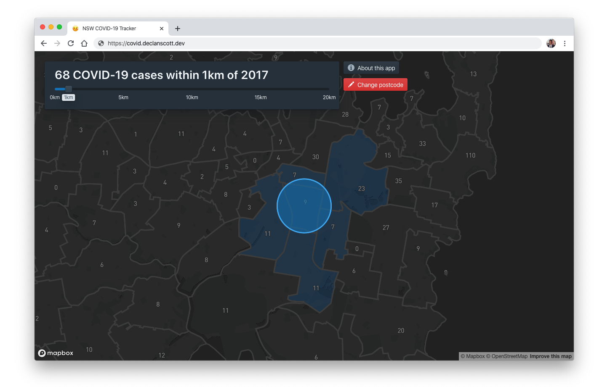

# NSW COVID-19 Map

NSW COVID-19 Map is a web app which lets you view the distribution of COVID-19 cases in NSW. It uses [NSW Health data](https://data.nsw.gov.au/data/dataset/covid-19-cases-by-location), which is provided on a per-postcode level. A range slider lets you see how many cases are near a given suburb.

## Tech

- CI though Netlify
- Built with React, TypeScript, and MapBox

## Contributing

Pull requests are welcome. For major changes, please open an issue first to discuss what you would like to change.

## License

[MIT](https://choosealicense.com/licenses/mit/)
